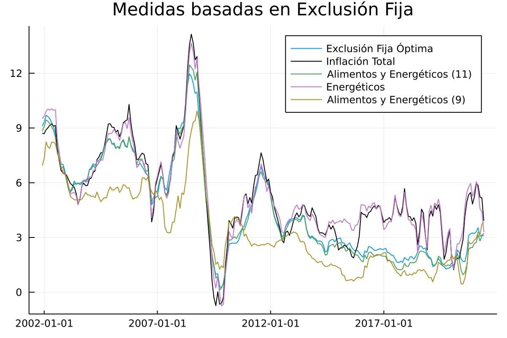

# Exclusión fija de gastos básicos

En esta sección se documentan los resultados del proceso de evaluación de las medidas de inflación interanual basadas en los métodos de exclusión fija de gastos básicos del IPC..

Medidas de exclusión fija evaluadas
 1. Exclusión Fija de Alimentos y energéticos variante 11
 2. Exclusión Fija de Energéticos 
 3. Exclusión Fija de Alimentos y energéticos variante 9
 4. Exclusión Fija Óptima 

## Resultados de evaluación con criterios básicos a diciembre de 2020

| Medida                     |    MSE | Error Estándar |
| :------------------------- | -----: | -------------: |
| Exclusión Óptima           |  0.646 |          0.001 |
| Alimentos y Energéticos 11 |  0.889 |          0.002 |
| Alimentos y Energéticos 9  |  2.989 |          0.003 |
| Energéticos                | 78.363 |          2.212 |

### Exclusión Fija Óptima

En total, luego del proceso de optimización, se excluyen 14 gastos básicos de la base 2000 y 18 gastos básicos de la Base 2010:

|  No.  | Gastos básicos excluidos en la base 2000 del IPC                               |
| :---: | :----------------------------------------------------------------------------- |
|   1   | Cebolla                                                                        |
|   2   | Tomate                                                                         |
|   3   | Otras cuotas fijas y extraordinarias en la educación preprimaria y primaria    |
|   4   | Papa o patata                                                                  |
|   5   | Zanahoria                                                                      |
|   6   | Culantro o cilantro                                                            |
|   7   | Güisquil                                                                       |
|   8   | Gastos derivados del gas manufacturado y natural y gases licuados del petróleo |
|   9   | Transporte aéreo                                                               |
|  10   | Otras verduras y hortalizas                                                    |
|  11   | Frijol                                                                         |
|  12   | Gasolina                                                                       |
|  13   | Otras cuotas fijas y extraordinarias en la educación secundaria                |
|  14   | Transporte urbano                                                              |

|  No.  | Gastos básicos excluidos en la base 2010 del IPC |
| :---: | :----------------------------------------------- |
|   1   | Tomate                                           |
|   2   | Culantro                                         |
|   3   | Cebolla                                          |
|   4   | Chile pimiento                                   |
|   5   | Gas Propano                                      |
|   6   | Papa                                             |
|   7   | Güisquil                                         |
|   8   | Diesel                                           |
|   9   | Lechuga                                          |
|  10   | Hierbabuena                                      |
|  11   | Servicio de transporte aéreo                     |
|  12   | Zanahoria                                        |
|  13   | Aguacate                                         |
|  14   | Gasolina regular                                 |
|  15   | Otras legumbres y hortalizas                     |
|  16   | Repollo                                          |
|  17   | Ejotes                                           |
|  18   | Gasolina superior                                |

!!! note 
    
    En comparación con la optimización con criterios básicos a 2019, hay un gasto básico adicional en las exclusiones de la base 2010 (Ejotes), los 17 gastos básicos restantes únicamente cambiaron el orden dentro del vector de exclusión.

## Descomposición aditiva del MSE

| Medida                     | Comp. Sesgo | Comp. Varianza | Comp. Covarianza |
| :------------------------- | ----------: | -------------: | ---------------: |
| Exclusión Óptima           |       0.123 |          0.136 |            0.388 |
| Alimentos y Energéticos 11 |       0.195 |          0.256 |            0.438 |
| Alimentos y Energéticos 9  |       2.200 |          0.141 |            0.647 |
| Energéticos                |       9.860 |         59.895 |            8.609 |

## Métricas de evaluación 

| Medida                     |  RMSE |     ME |   MAE | Huber | Correlación |
| :------------------------- | ----: | -----: | ----: | ----: | ----------: |
| Exclusión Óptima           | 0.795 | -0.300 | 0.645 | 0.293 |       0.972 |
| Alimentos y Energéticos 11 | 0.924 | -0.385 | 0.753 | 0.377 |       0.970 |
| Alimentos y Energéticos 9  | 1.716 | -1.460 | 1.540 | 1.067 |       0.950 |
| Energéticos                | 4.240 |  1.645 | 2.322 | 1.918 |       0.758 |

## Trayectorias de inflación observada

### Exclusión Fija óptima

### Medidas de Exclusión Fija
